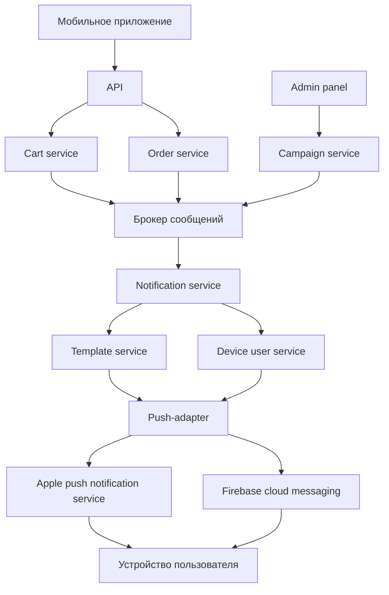

Cart service, Order cervice - бизнес-микросервисы, которые инициируют отправку пушей при появлении события 
Брокер сообщений - Kafka, RabbitMQ 
Notification service - сервис, обеспечивающий доставку сообщений с сервера на клиент в реальном времени 
Template service - сервис шаблонов, формирующий контент сообщений 
Device user service - сервис, хранящий device token пользователей и управляющий подписками пользователей 
Campaign service - сервис, позволяющий отправлять сообщения с админки (Admin panel) 
Push-adapter - модуль, адаптирующий сообщение под нужный формат для APNS или FCM 
APNS, FCM - облачные сервисы для отправки push-уведомлений на iOS/Android 
